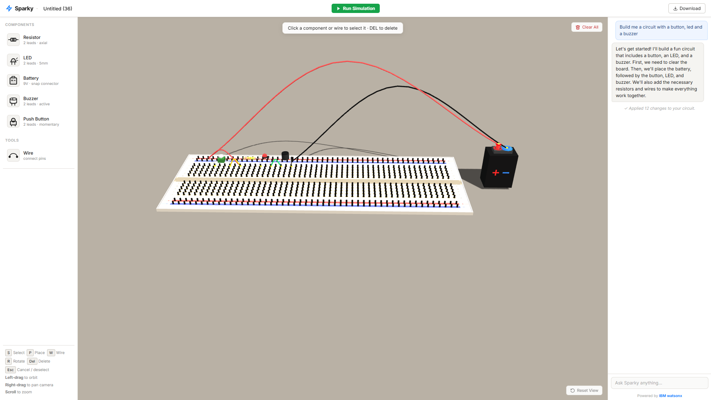

# Sparky

A 3D circuit designer that runs right in your browser. Drop components onto a breadboard, wire them up, simulate the circuit, and ask the built-in AI tutor for help.



---

## What can it do?

- **Build circuits in 3D** -- place resistors, LEDs, batteries, buzzers, and push buttons onto a realistic breadboard
- **Draw wires** between any two holes or pins, pick from 6 colors
- **Simulate** -- hit play and watch LEDs light up, click buttons to open/close the circuit in real time
- **AI tutor** -- ask Sparky a question and it explains what's going on, or tell it to build a circuit and it places the parts for you
- **Conversation memory** -- Sparky remembers your conversation within a session so you can build on previous messages
- **Save and load** -- export your circuits as `.sparky` files and share them

## Quick start

**Just the 3D designer (no AI):**

Open `circuit3d/index.html` in your browser. That's it. No install, no server, no npm.

**With the AI tutor:**

You need Node.js 18+ and a Google Gemini API key (free tier available).

```bash
cd backend

# Create a .env file with your API key
echo "GEMINI_API_KEY=your_gemini_api_key_here" > .env

node server.js
```

Then open `http://localhost:5001` in your browser. The chat panel on the right connects to the backend automatically.

**Getting a Gemini API key:**

1. Go to [Google AI Studio](https://aistudio.google.com/apikey)
2. Click "Create API key"
3. Copy it into your `.env` file

The free tier gives you plenty of requests per day for personal use.

## Controls

| Key | What it does |
| --- | --- |
| `S` | Select mode -- click stuff to select it, then Delete to remove |
| `P` | Place mode -- hover to preview, click to drop |
| `W` | Wire mode -- click two holes/pins to connect them |
| `R` | Rotate component before placing |
| `Esc` | Cancel whatever you're doing |

You can also just click components in the sidebar to start placing them.

## How the simulation works

The simulator models the breadboard as a graph. Holes in the same column on the same side of the center channel are electrically connected (just like a real breadboard). Power rails run the full length of the board.

When you hit simulate, it:
1. Maps every hole and wire into a connectivity graph using Union-Find
2. Finds **all** paths from battery+ to battery- (not just the first one, this is what makes parallel circuits work)
3. Calculates current through each path: `I = (9V - LED voltage drops) / total resistance`
4. Lights up any LED getting enough current

Push buttons work during simulation too -- click them to toggle the circuit on and off.

## How the AI works

When you send a message, the app snapshots your entire board (components, positions, wires) as a markdown table and sends it to Gemini along with your question and your conversation history.

Gemini uses **function calling** to interact with the board. Instead of generating raw JSON, it calls structured tools like `place_resistor(holeA="a3", holeB="a7")` and `add_wire(from="tp_3", to="a3", color="red")`. A server-side validation layer catches common mistakes (like forgetting to wire the battery to the rails) and auto-fixes them.

So you can literally type "build me 3 LEDs" and watch it happen.

## Project structure

```
circuit3d/
  index.html          The app (+ inline chat JS)
  css/                 Styling
  js/
    scene.js           Three.js scene setup
    breadboard.js      Procedural breadboard geometry
    components.js      3D component models
    interaction.js     Mouse/keyboard handling
    simulate.js        Circuit simulation engine
    app.js             Ties everything together

backend/
  server.js            AI backend + static server (zero npm dependencies)
  .env                 Your API key (not committed)
```

Everything is vanilla JS. No build tools, no frameworks, no bundler. The 3D components are all built from basic Three.js shapes, so the whole app works offline from the file system (minus the AI).

## Tech stack

| What | How |
| --- | --- |
| 3D | Three.js r128 from CDN |
| Frontend | Plain HTML/CSS/JS |
| AI backend | Node.js http module, zero dependencies |
| AI model | Gemini 2.0 Flash (Google) |
| AI features | Native function calling, conversation memory, circuit validation |

## .env reference

| Variable | Required | Description |
| --- | --- | --- |
| `GEMINI_API_KEY` | Yes | Your Google Gemini API key ([get one here](https://aistudio.google.com/apikey)) |
| `PORT` | No | Server port (default: 5001) |
| `GOOGLE_CLIENT_ID` | No | Google OAuth 2.0 client ID (for login, [setup guide below](#google-oauth-setup)) |
| `GOOGLE_CLIENT_SECRET` | No | Google OAuth 2.0 client secret |
| `CLOUDANT_URL` | No | IBM Cloudant URL (for cloud circuit storage) |
| `CLOUDANT_APIKEY` | No | IBM Cloudant API key |

Only `GEMINI_API_KEY` is needed to get started. The Google OAuth and Cloudant variables are for optional cloud login and storage features.

## Google OAuth setup

This is **optional** — only needed if you want the "Sign in with Google" feature for saving circuits to the cloud. It's completely free.

1. Go to [Google Cloud Console](https://console.cloud.google.com/apis/credentials)
2. Create a new project (or select an existing one)
3. Click **Create Credentials** → **OAuth 2.0 Client ID**
4. Set application type to **Web application**
5. Under **Authorized redirect URIs**, add:
   - `http://localhost:5001/api/auth/callback` (for local dev)
   - Your production URL + `/api/auth/callback` (if deploying)
6. Copy the **Client ID** and **Client Secret** into your `.env` file

---

*Made by [Enes Yilmaz](https://enes.web.app) and Colin Lee*
