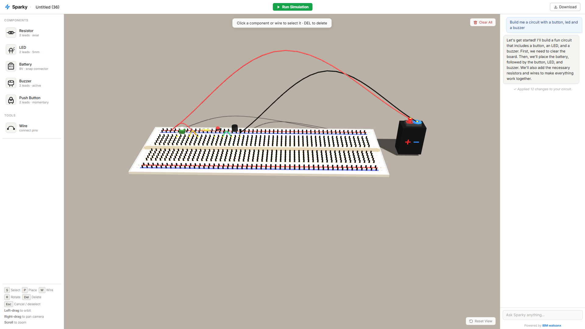

# Sparky

A 3D circuit designer that runs right in your browser. Drop components onto a breadboard, wire them up, simulate the circuit, and ask the built-in AI tutor for help.

**[Try it live at sparkylab.web.app](https://sparkylab.web.app)**



---

## What can it do?

- **Build circuits in 3D** -- place resistors, LEDs, batteries, buzzers, and push buttons onto a realistic breadboard
- **Draw wires** between any two holes or pins, pick from 6 colors
- **Simulate** -- hit play and watch LEDs light up, click buttons to open/close the circuit in real time
- **AI tutor** -- ask Sparky a question and it explains what's going on, or tell it to build a circuit and it places the parts for you
- **Conversation memory** -- Sparky remembers your conversation within a session so you can build on previous messages
- **Save and load** -- export your circuits as `.sparky` files and share them

## Quick start

Open `circuit3d/index.html` in your browser. That's it. No install, no server, no npm.

The AI tutor works from that same plain file open: the chat panel calls the Google Gemini API directly from the browser. The key it sends lives in `circuit3d/index.html` next to `GEMINI_KEY`. If you are running your own copy, replace it with your own key from [Google AI Studio](https://aistudio.google.com/apikey) (free tier, plenty of requests per day for personal use).

**The backend is optional and nothing in the app calls it.**

`backend/server.js` is a standalone Node 18+ server with zero npm dependencies. It serves the static files and exposes its own `/api/ask` Gemini endpoint, Google OAuth routes, and Cloudant circuit storage. The shipped frontend does not use any of it -- the chat panel goes straight to Gemini, and sign-in and cloud sharing go through Firebase Auth and Firestore. Run it only if you want that server-side path:

```bash
cd backend

# Create a .env file with your API key
echo "GEMINI_API_KEY=your_gemini_api_key_here" > .env

node server.js
```

Then open `http://localhost:5001`.

## Controls

| Key | What it does |
| --- | --- |
| `S` | Select mode -- click stuff to select it, then Delete to remove |
| `P` | Place mode -- hover to preview, click to drop |
| `W` | Wire mode -- click two holes/pins to connect them |
| `R` | Rotate component before placing |
| `Esc` | Cancel whatever you're doing |
| `Ctrl+Z` | Undo the last placement, wire, delete, Clear All, or file open |
| `Ctrl+Shift+Z` | Redo |

You can also just click components in the sidebar to start placing them.

## How the simulation works

The simulator models the breadboard as a graph. Holes in the same column on the same side of the center channel are electrically connected (just like a real breadboard). Power rails run the full length of the board.

When you hit simulate, it:
1. Maps every hole and wire into a connectivity graph using Union-Find
2. Finds **all** paths from battery+ to battery- (not just the first one, this is what makes parallel circuits work)
3. Calculates current through each path: `I = (9V - LED voltage drops) / total resistance`
4. Lights up any LED getting enough current

Push buttons work during simulation too -- click them to toggle the circuit on and off.

## How the AI works

When you send a message, the app snapshots your entire board (components, positions, wires) as a markdown table and sends it to Gemini along with your question and your conversation history.

Gemini uses **function calling** to interact with the board. Instead of generating raw JSON, it calls structured tools like `place_resistor(holeA="a3", holeB="a7")` and `add_wire(from="tp_3", to="a3", color="red")`. The returned tool calls are shown as a ghost preview first, and only get applied to the board when you accept them.

So you can literally type "build me 3 LEDs" and watch it happen.

`backend/server.js` also has a validation pass that auto-injects missing battery and rail wires before returning the tool calls, but that only runs on the backend's own `/api/ask` endpoint, which the frontend never calls.

## Project structure

```
landing.html          Marketing page + Firebase sign-in
dashboard.html        Saved circuits, shared "sparks" (Firestore)

circuit3d/
  index.html          The app (+ inline chat JS and Gemini calls)
  css/                 Styling
  js/
    scene.js           Three.js scene setup
    breadboard.js      Procedural breadboard geometry
    components.js      3D component models
    interaction.js     Mouse/keyboard handling
    simulate.js        Circuit simulation engine
    app.js             Ties everything together

backend/
  server.js            Optional standalone server, not called by the frontend
  .env                 Your API key (not committed)
```

Everything is vanilla JS. No build tools, no frameworks, no bundler. The 3D components are all built from basic Three.js shapes, so the whole app works offline from the file system (minus the AI).

## Tech stack

| What | How |
| --- | --- |
| 3D | Three.js r128 from CDN |
| Frontend | Plain HTML/CSS/JS |
| AI model | Gemini 2.0 Flash (Google), called from the browser |
| AI features | Native function calling, conversation memory, preview before apply |
| Auth + cloud storage | Firebase Auth + Firestore |
| Optional backend | Node.js http module, zero dependencies |

## .env reference

| Variable | Required | Description |
| --- | --- | --- |
| `GEMINI_API_KEY` | Yes | Your Google Gemini API key ([get one here](https://aistudio.google.com/apikey)) |
| `PORT` | No | Server port (default: 5001) |
| `GOOGLE_CLIENT_ID` | No | Google OAuth 2.0 client ID (for login, [setup guide below](#google-oauth-setup)) |
| `GOOGLE_CLIENT_SECRET` | No | Google OAuth 2.0 client secret |
| `CLOUDANT_URL` | No | IBM Cloudant URL (for cloud circuit storage) |
| `CLOUDANT_APIKEY` | No | IBM Cloudant API key |

These apply to `backend/server.js` only. The app as shipped needs none of them: it reads its Gemini key from `circuit3d/index.html` and uses Firebase for sign-in and cloud storage.

## Google OAuth setup

This is **optional** and applies to the backend only. The shipped app signs in through Firebase instead, so you do not need any of this to use Sparky.

1. Go to [Google Cloud Console](https://console.cloud.google.com/apis/credentials)
2. Create a new project (or select an existing one)
3. Click **Create Credentials** → **OAuth 2.0 Client ID**
4. Set application type to **Web application**
5. Under **Authorized redirect URIs**, add:
   - `http://localhost:5001/api/auth/callback` (for local dev)
   - Your production URL + `/api/auth/callback` (if deploying)
6. Copy the **Client ID** and **Client Secret** into your `.env` file

---

*Made by [Enes Yilmaz](https://enes.web.app) and Colin Lee*
