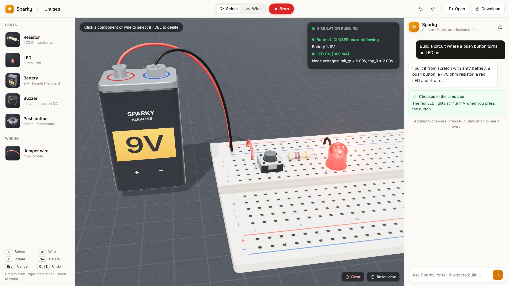
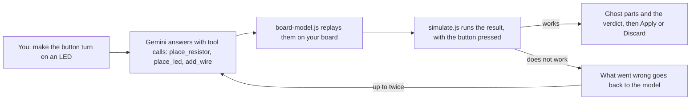

<h1 align="center">Sparky</h1>

<p align="center"><b>A 3D breadboard in your browser, with an AI tutor that checks its own work.</b><br>
Place parts, wire them up and run the circuit. Ask Sparky to build something and it tests the build in the same simulator before you see it.</p>

<p align="center">
  <a href="https://buildwithsparky.web.app"></a><br>
  <a href="https://buildwithsparky.web.app"><b>Open Sparky</b></a>
</p>

## What it does

- **Build in 3D.** Resistors, LEDs, a 9V battery, a buzzer and a push button, modeled to scale on a 700-hole breadboard. Leads bend to fit the holes they are given, and every hole takes exactly one lead or one wire end.
- **Wire it.** Click two holes, or a hole and a battery terminal. Six wire colors.
- **Run it.** The simulator solves the whole circuit, so each LED lights at the current it really gets. Click the button while it runs to press it.
- **Ask Sparky.** Tell it what to build, or ask why an LED is dark. Every build it proposes shows up as ghost parts on your board with the simulator's verdict, and nothing changes until you press Apply.
- **Keep it.** Undo and redo, save and open `.sparky` files, and after signing in, a dashboard of your circuits and a gallery to share them in.

The editor and the simulator run entirely in the browser. Only Sparky needs the server.

## How the simulation works

The board becomes a netlist. The five holes of a strip (a to e, or f to j, in one column) are one node, each rail is one node, and a wire joins two nodes. A resistor stamps a conductance, the battery is a voltage source, a pressed button is a short and an LED is a diode whose forward voltage comes from its color (2.0 V red, 2.2 V green, 3.2 V blue).

[`circuit3d/js/mna.js`](circuit3d/js/mna.js) solves that netlist with Modified Nodal Analysis, the method SPICE uses. The diodes are nonlinear, so it runs Newton-Raphson until the node voltages stop moving. Out come every node voltage and every branch current. Two LEDs in parallel share the current properly, a backwards LED blocks it, and a resistor that is too small shows up as 70 mA through a part rated for 20.

## How Sparky works


```mermaid
flowchart LR
  Q["You: make the button turn on an LED"] --> M["Gemini answers with tool calls: place_resistor, place_led, add_wire"]
  M --> R["board-model.js replays them on your board"]
  R --> S["simulate.js runs the result, with the button pressed"]
  S -->|works| P["Ghost parts and the verdict, then Apply or Discard"]
  S -->|does not work| F["What went wrong goes back to the model"]
  F -->|up to twice| M
```

The server sends your board and the conversation to Gemini, which answers with tool calls such as `place_led(holeA: "c13", holeB: "c11")`. [`board-model.js`](circuit3d/js/board-model.js) replays them against your board: a lead aimed at a taken hole moves along its strip to a free one, so parts never stack. [`backend/verify.js`](backend/verify.js) then runs the result through the same simulator the editor uses. If an LED stays dark or burns out, the reason goes back to the model and it tries again, twice at most. The reply says what the first try got wrong.

The editor replays the same actions through the same board model, so the preview, the parts you apply and the server's check always agree.

## Run it locally

The server serves the pages and answers Sparky:

```bash
cd backend
echo "GEMINI_API_KEY=your_key_here" > .env
node server.js
```

Then open `http://localhost:5001`. The server is Node 18 or newer with no dependencies. The Gemini key only ever lives on the server; the browser posts to `/api/ask`.

| Variable | Default | What it does |
| --- | --- | --- |
| `GEMINI_API_KEY` | | Your [Gemini API key](https://aistudio.google.com/apikey). Needed unless `AI_PROVIDER` says otherwise |
| `GEMINI_MODEL` | `gemini-flash-latest` | Pin a Gemini model |
| `AI_PROVIDER` | `gemini` | `claude` uses the local Claude Code CLI, `fixture` replays recorded answers with no key |
| `CLAUDE_MODEL` | `sonnet` | Model for the `claude` provider |
| `PORT` | `5001` | Server port |

## Tests

```bash
npm test
```

Runs the board model, the solver, the simulator, the build checker and the server against a stub model. Nothing touches the network.

## Controls

| Key | What it does |
| --- | --- |
| `S` | Select: click a part or a wire, then Delete removes it |
| `W` | Wire: click two holes or pins |
| `R` | Rotate the part you are placing |
| `Esc` | Cancel |
| `Ctrl+Z` / `Ctrl+Shift+Z` | Undo / redo |

Click a part in the library to start placing it. Drag to orbit, right-drag to pan, scroll to zoom.

## Project structure

```
landing.html            The front page, with a live 3D preview
dashboard.html          Your saved circuits and the shared gallery (Firebase)
circuit3d/
  index.html            The editor
  viewer.html           The read-only preview the front page embeds
  js/
    board-model.js      Hole addresses, part ids, one lead per hole, replaying actions
    breadboard.js       The board: geometry, drawn holes, connectivity
    components.js       The part models
    scene.js            Renderer, lights and camera
    interaction.js      Placing, wiring and selecting
    mna.js              The circuit solver
    simulate.js         Board to netlist, results, lit LEDs and buzzers
    chat.js             The Sparky panel: ask, preview, apply
    inspector.js        The selected part's values
    app.js              State, undo, saving and loading
backend/
  server.js             Static files and /api/ask
  verify.js             Runs every proposed build in the simulator
  ai-providers.js       Gemini, the Claude CLI, or recorded fixtures
test/                   node --test suites
```

Plain HTML, CSS and JavaScript with [three.js](https://threejs.org) r128. No build step.

---

<sub>Made by [Enes Yilmaz](https://enes.web.app) and [Colin Lee](https://github.com/ColinL-code).</sub>
